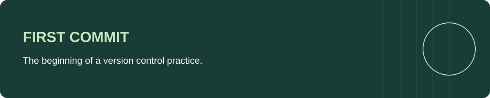

# First Git Project

My first Git practice repository, created in April 2021. It records the start of my work with repositories and version control.

The repository contains this README and an empty `hello_world.txt` file. There is no application, dependency setup, or executable demo.

---

## Author

**Kenneth Yeaher**  
BS in Information Science  
University of Maryland, College Park  

`Git` · `Version Control`
