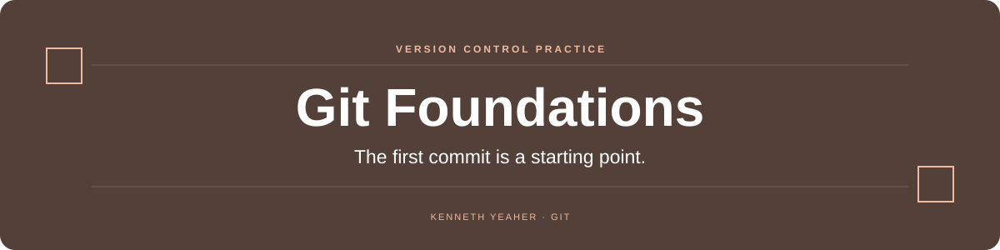

  

  

<a href="hello_world.txt">Practice file</a>

## Overview

Kenneth’s first Git practice repository. A deliberately small workspace for learning how local files, commits, and a remote repository fit together.

## At a glance

| Area | What to look for |
| --- | --- |
| **Contents** | A README and `hello_world.txt`. |
| **Focus** | Basic repository setup and version-control practice. |

## Start here

Clone the repository and inspect the files and commit history. There is no application or build step.

## Scope

This records an early learning exercise, not a software product.

---

<strong>Original project note</strong>

This is Kenneth's first git project!

